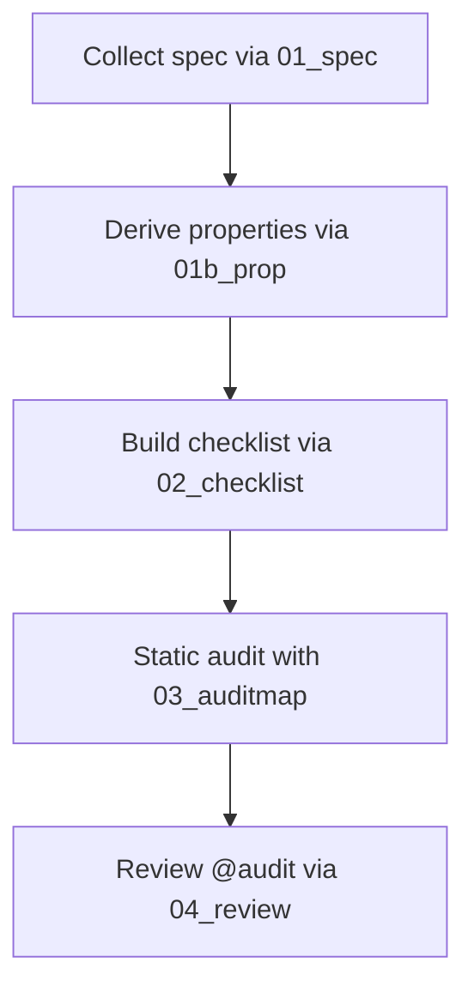

### 監査エージェントのアプローチ

監査エージェントは、プロのホワイトハッカーがセキュリティレビューで辿る思考と手続きを自動化パイプラインとして再構成したものです。仕様の理解から脆弱性仮説の立案、チェックリスト化、コード監査、レビュー完了までを連続したフローで支援します。

**特徴 / アプローチ**
- **仕様駆動:** EIP や公式ドキュメントを含む一次情報を基に、信頼境界・ユーザーフロー・アルゴリズムを正確に抽出し、監査対象を明確化します。
- **プロパティ中心:** 正常系プロパティと対となるアンチプロパティを定義し、既知のバグ類型にマッピングすることで攻撃シナリオを列挙します。
- **自動化されたチェックリスト:** プロパティごとに静的解析や動的検証の手順、観測指標、想定攻撃チェーンを紐付け、再現性の高い監査タスクを生成します。
- **静的監査とフィードバック:** チェックリストをもとにソースコードを走査し、証跡付きの `@audit` コメントと JSON ログを蓄積します。レビュー段階で結果を精査し、`@audit-ok` へ反映して監査マップを更新します。
- **継続適応:** JSON 生成物を介して各工程が疎結合に保たれているため、仕様変更やファイル構造の差異にも追従できます。

監査パイプラインは次のステージで構成されます:



#### 1. Preparation
目的: 監査の土台となる仕様情報と安全性要求を整備し、後続工程で参照できる共通コンテキストを確立する。

##### 1-a. Spec Generation
目的: プロジェクト仕様を構造化し、信頼境界・ユーザーフロー・主要アルゴリズムを完全に把握する。
`input`: `対象プロジェクトのソースディレクトリ、CATEGORYで指定されたドメイン要件、参照URLなどの一次情報源。`
`output`: `security-agent/outputs/01_SPEC.json（metadata に収集条件を記録し、domains/user_flows/algorithms でドメイン別の信頼関係と手順を定義した仕様ドキュメント）`
```json
{
  "metadata": {
    "project_name": "string",
    "spec_generated_at": "RFC3339 timestamp",
    "source_directory": "string",
    "reference_urls": ["string"],
    "notes": "string"
  },
  "domains": [
    {
      "id": "string",
      "name": "string",
      "trusted_entities": ["string"],
      "user_flows": ["FLOW_REF"],
      "algorithms": ["ALGO_REF"],
      "metadata": {
        "sources": ["string"],
        "notes": "string"
      }
    }
  ],
  "user_flows": [
    {
      "id": "string",
      "title": "string",
      "actors": ["string"],
      "preconditions": ["string"],
      "steps": ["string"],
      "postconditions": ["string"],
      "sources": ["string"]
    }
  ],
  "algorithms": [
    {
      "id": "string",
      "title": "string",
      "inputs": ["string"],
      "procedure": ["string"],
      "trust_dependencies": ["string"],
      "outputs": ["string"],
      "sources": ["string"]
    }
  ]
}
```
この JSON は metadata にクロール条件・引用元・生成時刻を、domains にドメイン別の信頼主体と関連フロー/アルゴリズムを、user_flows と algorithms にノーマティブな手順詳細を保持する。

Algorithm:
1. 指定された TARGET_DIRECTORY と参照 URL をクロール対象として列挙し、CATEGORY で許可されたドメインのみを抽出する。
2. 抽出した資料から trusted_entities・user_flows・algorithms をそれぞれ正規化し、引用元とともに一次データセットを構築する。
3. user_flows に対して actors・preconditions・steps・postconditions を順序保持で整理し、ID を採番する。
4. algorithms について inputs・procedure・trust_dependencies・outputs を手続きレベルで分解し、ドメイン参照を付与する。
5. metadata にクロール起点、取得タイムスタンプ、参照 URL、備考を記録し、domains と user_flows/algorithms 間の参照整合性を検証する。
6. すべての要素を RFC3339 時刻基準で `security-agent/outputs/01_SPEC.json` に書き出し、既存ファイルを置き換える。

##### 1-b. Security Property Generation
目的: 仕様で定義された行動を安全性プロパティとアンチパターンに変換し、検証可能なセキュリティカタログを構築する。
`input`: `最新の01_SPEC.jsonで定義されたドメイン別仕様と、対応するアーキテクチャ資料・参照URL。`
`output`: `security-agent/outputs/01_PROP.json（metadata に生成メタデータ、properties にプロパティ/アンチプロパティのタプル、coverage にカバレッジ指数を保持する安全性カタログ）`
```json
{
  "metadata": {
    "project_name": "string",
    "spec_generated_at": "RFC3339 timestamp",
    "prop_generated_at": "RFC3339 timestamp",
    "stale": "boolean",
    "sources": ["string"],
    "notes": "string"
  },
  "properties": [
    {
      "property_id": "string",
      "property": "string",
      "anti_property": "string",
      "state_predicate": "string",
      "enforcement_scope": ["string"],
      "falsification": {
        "static": ["string"],
        "dynamic": ["string"],
        "expected_counterexample_signal": "string",
        "budget": {
          "timeout_s": "number",
          "max_cases": "number",
          "seed": "string"
        }
      },
      "observability": {
        "signals": ["string"],
        "alert_rules": ["string"],
        "thresholds": ["string"]
      },
      "testing_hooks": [
        {
          "command": "string",
          "env": {
            "KEY": "value"
          }
        }
      ],
      "parity_vectors": ["PARITY_VECTOR_REF"],
      "spec_refs": ["string"],
      "trust_scope": "trusted|conditionally_trusted|untrusted",
      "criticality": {
        "impact": "low|medium|high|critical",
        "likelihood": "low|medium|high"
      },
      "confidence": "low|medium|high",
      "status": "verified|pending-detail|needs-refresh|error",
      "notes": "string"
    }
  ],
  "coverage": {
    "summary": {
      "domains_total": "integer",
      "flows_total": "integer",
      "flows_covered": "integer",
      "algorithms_total": "integer",
      "algorithms_covered": "integer",
      "state_machines_total": "integer",
      "state_machines_covered": "integer"
    },
    "gaps": [
      {
        "type": "domain|flow|algorithm|state_machine",
        "id": "string",
        "reason": "string",
        "status": "pending-detail|needs-refresh"
      }
    ]
  }
}
```
この JSON は metadata に生成タイムスタンプと参照ソース、properties に各安全性プロパティの検証条件と優先度、coverage に仕様要素の網羅状況を集約する。

Algorithm:
1. `security-agent/outputs/01_SPEC.json` を読み込み、domains・user_flows・algorithms を基にプロパティ候補を列挙する。
2. 各候補について property/anti_property と state_predicate/enforcement_scope を定義し、spec_refs と trust_scope を紐付ける。
3. falsification セクションに静的解析クエリや動的テスト手順を設計し、expected_counterexample_signal と budget を設定する。
4. observability・testing_hooks・parity_vectors をプロパティ毎に設計し、検証コマンドと証跡指標を記述する。
5. metadata に spec_generated_at との差分から stale フラグを計算し、criticality・confidence・status を評価基準に沿って割り当てる。
6. coverage.summary を算出し、未カバーのドメイン/フロー/アルゴリズムを gaps に追加したうえで `security-agent/outputs/01_PROP.json` を出力する。

#### 2. Checklist Generation
目的: プロパティカタログを実務的な監査タスクへ展開し、網羅的かつ再現可能な検証手順を整備する。
`input`: `プロパティカタログに定義された安全性プロパティ群、仕様情報、過去のインシデント記録や既存チェックリスト。`
`output`: `security-agent/outputs/02_CHECKLIST.json（metadata に生成状況、checklist_items にプロパティ別の検証手順や観測条件を格納する監査チェックリスト）`
```json
{
  "metadata": {
    "project_name": "string",
    "generated_at": "RFC3339 timestamp",
    "mode": "create|append",
    "schema_version": "string",
    "property_catalog_generated_at": "RFC3339 timestamp",
    "sources": ["string"],
    "coverage_summary": {
      "total_properties": "integer",
      "covered_properties": "integer",
      "missing_properties": ["PROPERTY_ID"],
      "property_id_mismatches": [
        {
          "check_id": "string",
          "seen_property_id": "string",
          "canonical_property_id": "string"
        }
      ]
    },
    "gaps": "string"
  },
  "checklist_items": [
    {
      "id": "string",
      "property_id": "string",
      "title": "string",
      "bug_class": "string",
      "risk_category": "integrity|availability|confidentiality|economic|compliance",
      "severity_hint": "low|medium|high|critical",
      "trust_scope": "trusted|conditionally_trusted|untrusted",
      "domains": ["string"],
      "languages": ["string"],
      "file_globs": ["string"],
      "attack_playbook_tags": ["string"],
      "attack_chain": {
        "prerequisites": ["string"],
        "combinators": ["string"]
      },
      "static_detectors": [
        {
          "tool": "string",
          "rule": "string",
          "command": "string",
          "notes": "string"
        }
      ],
      "patterns": ["string"],
      "detection_procedure": ["string"],
      "executable_checks": [
        {
          "command": "string",
          "expected_signal": "string"
        }
      ],
      "evidence_probes": [
        {
          "source": "string",
          "signal": "string",
          "expectation": "string"
        }
      ],
      "ok_if": ["string"],
      "not_ok_if": ["string"],
      "parity_vectors": ["PARITY_VECTOR_REF"],
      "bad_path_library": ["string"],
      "notes": "string",
      "version": "string",
      "revision_notes": "string",
      "references": ["string"],
      "status": "todo|in-progress|done"
    }
  ]
}
```
この JSON は metadata に生成メタ情報とカバレッジ統計を、checklist_items に各プロパティへ対応づけた検証パターン・攻撃連鎖・実行コマンド・証跡条件を格納する。

Algorithm:
1. プロパティカタログから property_id を列挙し、各 ID に紐づく検証目的とリスクカテゴリを決定する。
2. 各 property_id について静的検知ルール・detection_procedure・executable_checks・evidence_probes を設計し、信頼スコープと ok_if/not_ok_if を埋める。
3. attack_playbook_tags と attack_chain を過去インシデントや既知攻撃パターンから補強し、bad_path_library を構築する。
4. 既存の `security-agent/outputs/02_CHECKLIST.json` があれば `(id, property_id)` 単位でマージし、version と revision_notes を更新する。
5. metadata.coverage_summary を計算し、missing_properties と property_id_mismatches を記録して整合性を担保する。
6. metadata.gaps にブロッカーや追加資料の必要性を記述し、完成したオブジェクトを `security-agent/outputs/02_CHECKLIST.json` に保存する。

#### 3. Static Audit
目的: チェックリストをもとにコードベースへ静的検査を仕掛け、潜在的な脆弱性や調査項目を体系的に収集する。
`input`: `チェックリストで定義された検証手順、プロパティ/アンチプロパティ、対象コードベース全体（PATH指定）。`
`output`: `security-agent/outputs/03_AUDITMAP.json（audit_items に調査結果、summary にリスク統計を append する継続的な監査ログ／コード側には @audit コメント例（// @audit Reentrancy: external call before state lock）を追記）`
```json
{
  "audit_items": [
    {
      "id": "string",
      "check_id": "string",
      "file": "string",
      "line": "integer",
      "snippet": "string",
      "risk_category": "integrity|availability|confidentiality|economic|compliance",
      "severity": "low|medium|high|critical",
      "property": "string",
      "anti_property": "string",
      "static_detector": "string",
      "executable_property": "string",
      "evidence_probe": "string",
      "attack_chain": ["string"],
      "attack_chain_score": "number",
      "observability": "string",
      "status": "vuln|needs-investigation",
      "round": "integer",
      "call_stack": ["string"],
      "evidence": "string",
      "notes": "string",
      "tags": ["string"]
    }
  ],
  "summary": {
    "path": "string",
    "audit_items_total": "integer",
    "vuln_count": "integer",
    "needs_investigation_count": "integer",
    "high_risk_hotspots": ["string"],
    "next_focus": "string"
  }
}
```
この JSON は audit_items に個別ファインディングの根拠・攻撃連鎖・観測状況を、summary に対象パスと統計サマリを保持し、監査ラウンドごとに追記する。

Algorithm:
1. 監査対象 PATH を再帰的に走査し、checklist_items の file_globs・languages をトリガに解析対象ファイルを決定する。
2. 各ファイルに対して該当チェックを適用し、検出したスニペットと property/anti_property の対応関係を評価する。
3. 見つかった事象ごとに attack_chain・attack_chain_score・observability を算出し、evidence や call_stack を抽出する。
4. 生成したファインディングに対して `@audit` コメントをコードへ挿入し、複合キー `<check_id>|<file>|<line>|hash(snippet)>` で重複を排除する。
5. summary を更新し、vuln_count・needs_investigation_count・high_risk_hotspots を再計算したうえで JSON を append モードで保存する。
6. 追加で parity_vectors や executable_property が存在する場合は対応するテストを実行し、結果を notes と evidence に反映する。

#### 4. Review audits
目的: 収集済みの監査結果を精査し、リスクの確定・解消・フォローアップ指示を体系化して監査マップへ反映する。
`input`: `既存の監査マップ項目、チェックリストの受容条件、仕様、実際のソースコードと関連外部情報。`
`output`: `更新済み security-agent/outputs/03_AUDITMAP.json とコード内の @audit / @audit-ok コメント（audit_items に審査結果、summary にレビュー統計を反映／解消済み箇所には @audit-ok コメント例（// @audit-ok Reentrancy: guarded by nonReentrant）を追記）`
```json
{
  "audit_items": [
    {
      "id": "string",
      "check_id": "string",
      "file": "string",
      "line": "integer",
      "snippet": "string",
      "risk_category": "string",
      "severity": "string",
      "property": "string",
      "anti_property": "string",
      "status": "vuln|needs-investigation|ok",
      "proof_trace": ["string"],
      "review_round": "integer",
      "notes": "string"
    }
  ],
  "summary": {
    "rounds": "integer",
    "total_audit_flags": "integer",
    "high_risk_hotspots": ["string"],
    "next_focus": "string"
  }
}
```
この JSON は audit_items にレビュー後のステータスと証跡、summary に審査ラウンドと優先フォーカスを集約し、最新状態を反映する。

Algorithm:
1. `security-agent/outputs/03_AUDITMAP.json` を読み込み、ファイル/行番号順に audit_items を走査する。
2. 各項目の原コード位置を開いてガード条件と実行経路を再確認し、チェックリストの ok_if/not_ok_if を参照する。
3. リスクが解消済みであると判断した場合はソースコメントを `@audit-ok` に更新し、該当 audit_item を削除する。
4. 継続リスクについては proof_trace を呼び出し経路で更新し、severity や notes を最新情報に合わせて強化する。
5. summary.rounds と total_audit_flags を再計算し、high_risk_hotspots と next_focus をアップデートする。
6. 追加調査が必要な項目には status を `needs-investigation` に維持したまま観測計画を notes に追記し、更新後の JSON を保存する。
