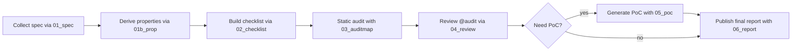

# ハッキング・ガイドライン

## ハッキングの流れ



## ハッキング・エージェントの全体像

### 方針（Whitehat Mental Model）
- プロパティファースト: 仕様の各ドメイン/フロー/アルゴリズムから安全性プロパティと対となるアンチプロパティを定義し、全ての検証をこのギャップ探索に紐付ける。
- 攻撃チェーン思考: NomadやWormholeなどの実例に基づいたプレイブックをチェックリスト化し、単発バグではなく連鎖イベントを前提に照合する。
- アルゴリズム反証駆動: 仕様アルゴリズムごとに異常経路（early true、delete-before-call など）を明文化し、静的解析と動的テストの両輪で潰す。
- クロス実装パリティ: EVM↔Cairoの入力/出力/ハッシュをベクトル化し、乖離をCIで検知できるようにする。
- 観測性の担保: すべてのプロパティにイベント・ログ・メトリクスなどの証跡を割り当て、異常時に即座に気付けるテレメトリ設計を要求する。

### プロンプトと狙い

| コマンド | 狙い | 主要入力 | 主な成果物 |
| --- | --- | --- | --- |
| [01_spec](prompts/01_spec.md) | 信頼境界・ドメイン・ユーザーフローを整理し、価値移動と依存関係を明文化した原典仕様を得る。 | なし | `security-agent/outputs/01_SPEC.json` |
| [01b_prop](prompts/01b_prop.md) | 仕様からプロパティ/アンチプロパティを抽出し、反証条件・観測指標・パリティベクトルまで紐付いた検証カタログを作る。 | `security-agent/outputs/01_SPEC.json` | `security-agent/outputs/01_PROP.json` |
| [02_checklist](prompts/02_checklist.md) | プロパティを攻撃プレイブックと静的/動的テクニックに落とし込み、再現性のある検証タスクへ編成する。 | `security-agent/outputs/01_SPEC.json`, `security-agent/outputs/01_PROP.json` | `security-agent/outputs/02_CHECKLIST.json` |
| [03_auditmap](prompts/03_auditmap.md) | チェックリストをソースに適用し、各プロパティが満たされているか/破られうるかを@audit注釈と証跡でマッピングする。 | `security-agent/outputs/02_CHECKLIST.json` | `security-agent/outputs/03_AUDITMAP.json` とソース内@audit注釈 |
| [04_review](prompts/04_review.md) | 監査メモと@auditの整合を見直し、検証の根拠・観測性・パリティが保持されているかを再度精査する。 | `security-agent/outputs/03_AUDITMAP.json` | 更新済みの `security-agent/outputs/03_AUDITMAP.json` |
| [05_poc](prompts/05_poc.md) | 発見したアンチプロパティが現実に成立することをPoCで立証し、再現手順と失敗シグナルを明確化する。 | `security-agent/outputs/03_AUDITMAP.json` | 指定パスのPoCテスト/スクリプト |
| [06_report](prompts/06_report.md) | プロパティ観点で攻撃シナリオを物語化し、再現性・影響・観測計画をまとめた最終レポートへ昇華する。 | `security-agent/outputs/03_AUDITMAP.json`, PoC成果物 | `security-agent/outputs/report_<slug>.md` |

### 参考文献

[1]: https://diligence.consensys.io/blog/2020/01/interview-with-samczsun/?utm_source=chatgpt.com "Interview with samczsun"
[2]: https://arxiv.org/html/2410.02029v3?utm_source=chatgpt.com "Identifying Anomalies in Cross-Chain Bridges"
[3]: https://www.gate.com/blog/1410/Nomad-Cross-Chain-Bridge-Suffers--190-Million-Exploit-in-a-Copy-Paste-Attack?utm_source=chatgpt.com "Nomad Cross-Chain Bridge Suffers $190 Million Exploit in a ..."
[4]: https://hyprelane.com/?utm_source=chatgpt.com "Hyperlane: Modular Bridge Security Prevents $3.5B+ Exploits"
[5]: https://www.sciencedirect.com/science/article/pii/S2096720925000429?utm_source=chatgpt.com "SoK: Cross-Chain Bridging Architectural Design Flaws and ..."
[6]: https://github.com/hyperlane-xyz/hyperlane-monorepo/issues?utm_source=chatgpt.com "Issues · hyperlane-xyz/hyperlane-monorepo"
[7]: https://mirror.xyz/pornstache.eth/QroKMN4feelgndtXPUbU2lBR8NkSoNOUjog808dO2zY?utm_source=chatgpt.com "Interviews with Contract Audit Specialists — pornstache.eth"
[8]: https://secureum.substack.com/p/audit-techniques-and-tools-101?utm_source=chatgpt.com "Audit Techniques & Tools 101 - by Rajeev - Secureum"

---

## ハッキング手順書

以下の手順に従い、エージェントベース監査を進めてください。

#### 1. ハッキング対象レポジトリのクローン

以下コマンドでクローン:
```
git clone <ハッキングしたいレポジトリ>
cd <レポジトリのルートディレクトリ>
```

---

#### 2. NyxFoundationのGitHub監査用レポ作成 (絶対にプライベートレポジトリ)

[NyxFoundationのGitHub OrgからCreate new repository](https://github.com/organizations/NyxFoundation/repositories/new) で `audit-<project>`（例: `audit-nimbus`）という名前の**プライベート**レポジトリを作成してください。もしレポジトリが既にある場合はレポ作成はしなくていい。

作成が完了したらリモートに追加:
```
git remote add audit git@github.com:NyxFoundation/<audit-repo>.git
```

---

#### 3. security-agentを準備

監査対象レポジトリのルートディレクトリで以下を実行:
```
git clone -b master git@github.com:NyxFoundation/security-agent.
./security-agent/setup.sh
git checkout -b audit-<監査者名>
```

監査リーダーは以下を実行(監査者はスキップ):
1. `security-agent/outputs/01_PAST_REPORTS/`に過去のハッカーレポートファイルを収納
2. `./security-agent/get_github_issues.sh  --repos list --keywords list`を実行
3. 01 → 01b → 02 のプロンプトを順に実行
4. ChatGPTに02のアウトプットファイルを洗練させる

---

#### 4. ハッキング

作業を始める前に必ず`master`ブランチを最新化し、フォルダパスごとにプロンプトを並行で実行する。

[./prompts/](./prompts)にあるプロンプトを03,04の順番に進めていく。

以下のようにテキストベースで引数を指定(引数はプロンプトのUsageを参考に):

```
codex --ask-for-approval never --sandbox workspace-write --search
>> /03_auditmap PATH=./src/
...

>> 未着手箇所の調査を続けて
x10
...
```

気をつけること
-  03_auditmap では各実行が途中で終了することがよくあるため、続けて `未着手箇所の調査を続けて` を 10 回前後送信する。
- 各ステップごとにcodexを立ち上げ直し、コンテキストウィンドウをリセットする。

---

#### 5. ハッキング結果のレビュー

`outputs/03_AUDITMAP.json`に`Vuln`とラベル付けされた項目があれば、それがどのようなバグで、どのような攻撃に繋がるのか理解し、妥当性を自己検証する。

必要であればChat-GPT-5-thinkingにも妥当性を検証してもらう。

---

#### 6. GitHubへアップ

```
git add .
git commit -m"hacking finished"
git push audit HEAD
```

#### 7. Discordでレビュー依頼

@grandchildriceへハッキング終了を報告

```
@grandchildrice

ハッキングが終わったので、確認お願いします。

<GitHubのリンク>
```
